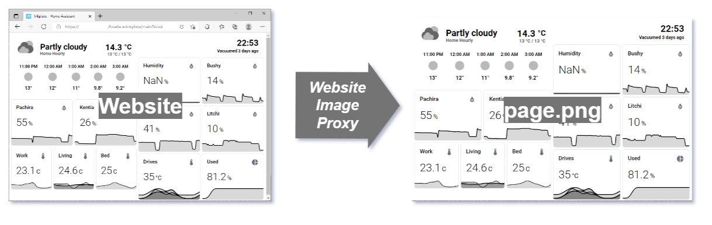

# Website Image Proxy

The Website Image Proxy is a simple service that tries to provide an up-to-date
screenshot of a website. This is useful for displaying websites on low-power IoT
devices like the [Inkplate], where running a full web browser is not feasible.



It will always serve the latest available screenshot immediately without
waiting. The neat trick it does is that it expects to be called on a regular
interval, so it learns this interval and updates the screenshot _just before_
each call is made. In practice, it means that the screenshots are always fresh
(less than a minute out of date) without the need for manual synchronization or
configuration.

## Usage

### Docker (recommended)

This is the easiest way as it includes all the dependencies needed already.
Tested on a Windows 10 PC (Docker for Desktop) and Synology DS418play.

1. Build and run the server via `docker-compose.yml`
    ```sh
    URL=https://google.com docker compose up --build
    ```
2. Go to http://localhost:8000/page.png to get a screenshot of the website
provided by the URL. You should get a HTTP 204 response until the first
screenshot has been made and afterwards the latest available screenshot.

You can also use an `.env` file:

```sh
# .env
URL=https://google.com
```
```sh
docker compose up
```

There are no prebuilt images available yet.

### node.js

This is also not too bad as Puppeteer downloads the required browsers
automatically, faster for development.

1. `npm install` (once to install dependencies)
2. Create an `.env` file to set up environment variables.
  ```sh
  # .env
  URL=https://google.com
  ```
3. `npm start` to run the server.
4. Go to http://localhost:8000/page.png to get a screenshot of the website
provided by the URL. You should get a HTTP 204 response until the first
screenshot has been made and afterwards the latest available screenshot.

## Built With

* [Puppeteer]
* [Fastify]

## Contributing
Pull requests are welcome. For major changes, please open an issue first to
discuss what you would like to change.

## License
[MIT](https://choosealicense.com/licenses/mit/)

[Inkplate]: https://inkplate.io/
[Puppeteer]: https://github.com/puppeteer/puppeteer
[Fastify]: https://www.fastify.io/
